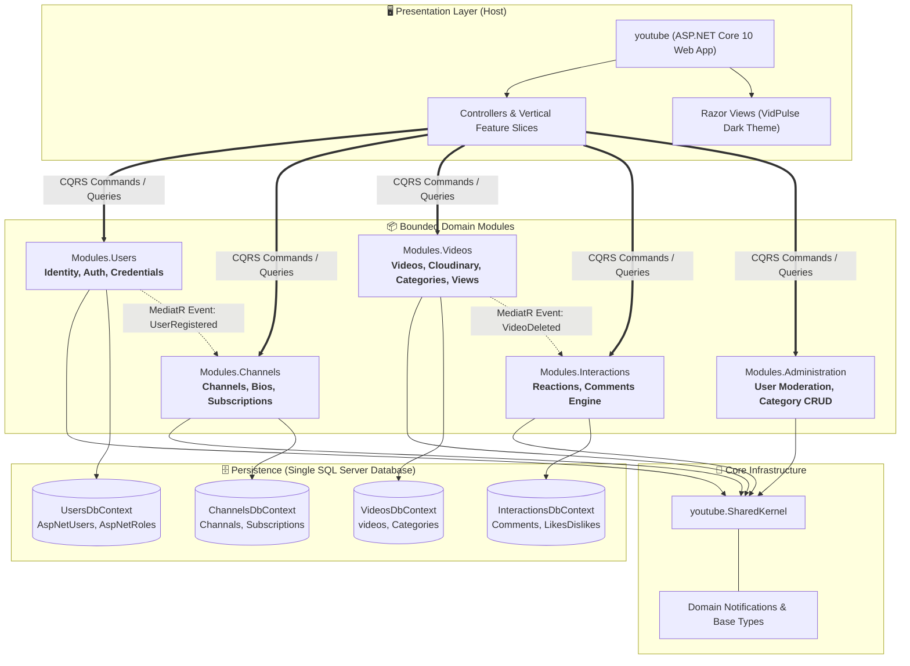
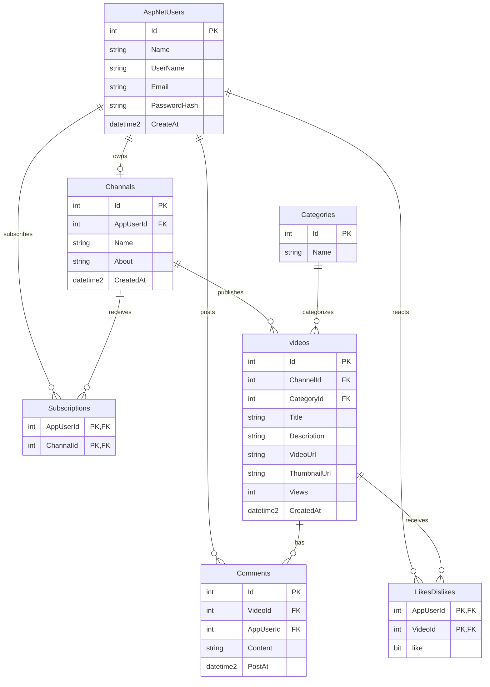
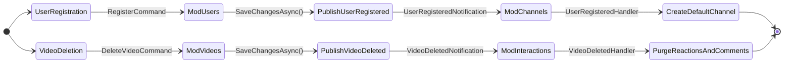
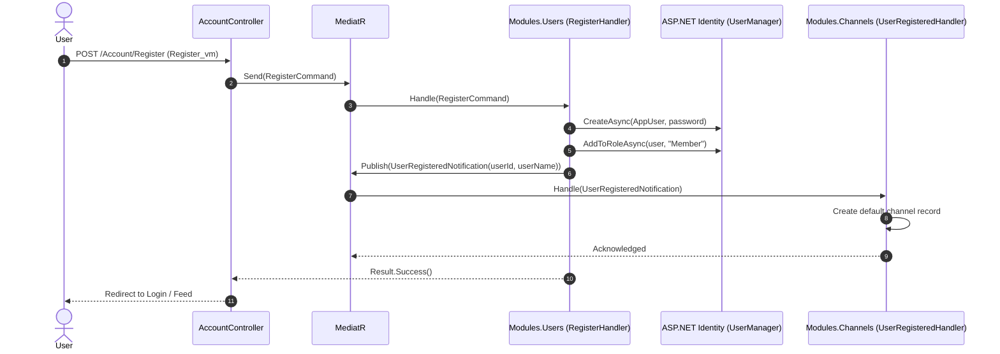
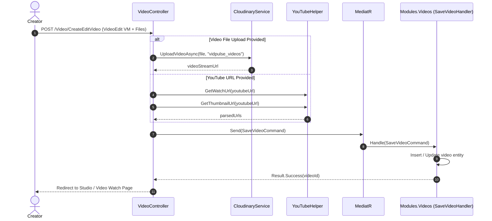
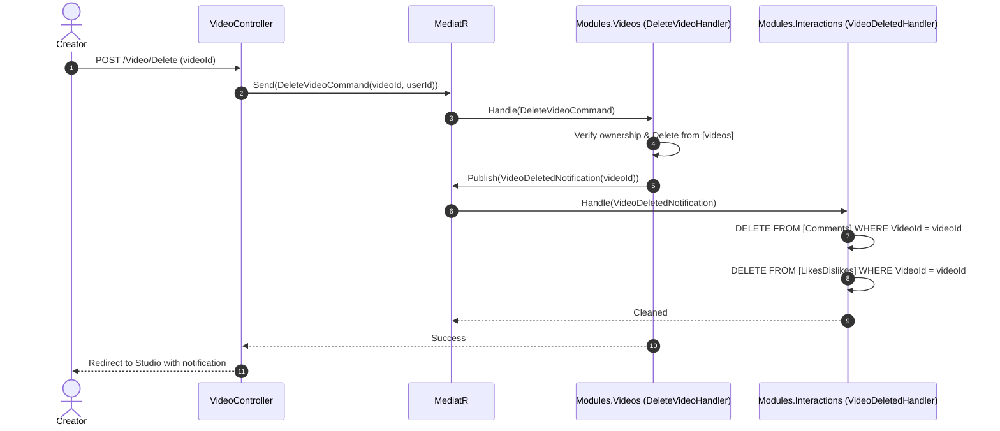

# 🎬 VidPulse — Enterprise Video Platform (Modular Monolith)

[](https://dotnet.microsoft.com/)
[](https://learn.microsoft.com/dotnet/csharp/)
[](#-modular-monolith-architecture)
[](https://learn.microsoft.com/ef/core/)
[](https://cloudinary.com/)
[-FF6F00)](#-inter-module-event-flow)

**VidPulse** is a high-performance video sharing, streaming, and channel ecosystem inspired by YouTube, re-engineered from a traditional 3-tier structure into an enterprise-grade **Modular Monolith**. It guarantees strict domain isolation, independent persistence contexts per module, event-driven decoupling via **MediatR**, and high-volume media upload capabilities.

---

## 📑 Table of Contents

- [🏛️ Modular Monolith Architecture](#️-modular-monolith-architecture)
- [📊 Database & Entity-Relationship Model (ERD)](#-database--entity-relationship-model-erd)
- [🔄 Inter-Module Event Flow](#-inter-module-event-flow)
- [⚡ Sequence Workflows](#-sequence-workflows)
  - [1. User Registration & Automatic Channel Bootstrapping](#1-user-registration--automatic-channel-bootstrapping)
  - [2. Video Upload, Transcoding & Embedding Pipeline](#2-video-upload-transcoding--embedding-pipeline)
  - [3. Video Deletion & Domain Event Cascade Cleanup](#3-video-deletion--domain-event-cascade-cleanup)
- [📦 Deep Dive: Domain Modules](#-deep-dive-domain-modules)
  - [Users Module (`Modules/Users`)](#1-users-module-modulesusers)
  - [Channels Module (`Modules/Channels`)](#2-channels-module-moduleschannels)
  - [Videos Module (`Modules/Videos`)](#3-videos-module-modulesvideos)
  - [Interactions Module (`Modules/Interactions`)](#4-interactions-module-modulesinteractions)
  - [Administration Module (`Modules/Administration`)](#5-administration-module-modulesadministration)
  - [Shared Kernel (`youtube.SharedKernel`)](#6-shared-kernel-youtubesharedkernel)
- [🌐 Web Host & Presentation Engine](#-web-host--presentation-engine)
- [🛣️ Complete Application Route Catalog](#️-complete-application-route-catalog)
- [🚀 Getting Started & Local Development](#-getting-started--local-development)
- [🛡️ Security, Performance & Scalability](#️-security-performance--scalability)

---

## 🏛️ Modular Monolith Architecture

Traditional 3-tier setups suffer from circular dependencies, monolithic `DbContext` god-objects, and leaky abstractions like generic `IRepository` and `IUnitOfWork`. VidPulse partitions business capabilities into **bounded contexts**, each owning its data model, business logic, and API contracts.



### Key Architectural Tenets

1. **Isolated DbContexts**: Each module manages an exclusive `DbContext`. No module ever queries or joins tables belonging to another context directly in SQL.
2. **Contract-Driven Boundaries**: Cross-module reads execute through dedicated read-only Queries and DTOs (e.g., `GetUserSummaryQuery`, `GetChannelSummaryQuery`).
3. **Eventual Consistency & Domain Events**: Mutative cross-module actions publish MediatR notifications (`INotification`) handled asynchronously by consumer modules.
4. **No Generic Repository Layer**: Handlers write EF Core LINQ queries directly with `.AsNoTracking()` and optimized projections, eliminating memory waste and performance overhead.

---

## 📊 Database & Entity-Relationship Model (ERD)

The system targets a unified SQL Server database (`vidpulsedb`) where table schemas are carefully mapped to preserve backward compatibility while maintaining bounded separation:



---

## 🔄 Inter-Module Event Flow

Modules stay strictly decoupled by delegating side effects to MediatR notifications.



| Event | Publisher | Consumer(s) | Business Action Taken |
|---|---|---|---|
| `UserRegisteredNotification` | `Modules.Users` | `Modules.Channels` | Automatically provisions a custom default channel for the new user. |
| `VideoDeletedNotification` | `Modules.Videos` | `Modules.Interactions` | Purges all comments, likes, and dislikes associated with the removed video. |
| `UserDeletedNotification` | `Modules.Administration` | `Modules.Channels`, `Modules.Videos` | Handles cascade deprovisioning when an account is banned or purged. |

---

## ⚡ Sequence Workflows

### 1. User Registration & Automatic Channel Bootstrapping



### 2. Video Upload, Transcoding & Embedding Pipeline



### 3. Video Deletion & Domain Event Cascade Cleanup



---

## 📦 Deep Dive: Domain Modules

### 1. Users Module (`Modules/Users`)
- **Primary Focus**: Security, Identity, authorization, and credential auditing.
- **Components**:
  - `AppUser`: Extends `IdentityUser<int>` with custom properties like `CreateAt` and display name.
  - `AppRole`: Extends `IdentityRole<int>` with role tracking.
  - `UsersDbContext`: Inherits `IdentityDbContext` targeting `AspNetUsers`, `AspNetRoles`, `AspNetUserClaims`, etc.
  - **Commands**: `LoginCommand`, `RegisterCommand`, `LogoutCommand`.
  - **Queries**: `GetUserSummaryQuery` (returns `UserSummaryDto`).

### 2. Channels Module (`Modules/Channels`)
- **Primary Focus**: Content creator presence, channel configuration, and subscription graph.
- **Components**:
  - `Channel`: Model representing channel metadata, bio, avatar, and creator association.
  - `Subscription`: Composite key `(AppUserId, ChannalId)` representing fan followings.
  - `ChannelsDbContext`: Maps `Channals` and `Subscriptions` tables.
  - **Commands**:
    - `CreateChannelCommand`: Allows creating a distinct channel profile.
    - `EditChannelCommand`: Updates bio and channel name.
    - `ToggleSubscribeCommand`: Subscribes or unsubscribes users, guarding against self-subscriptions.
  - **Event Handlers**: `UserRegisteredHandler` listens for new user creations to ensure every account has a studio channel ready.

### 3. Videos Module (`Modules/Videos`)
- **Primary Focus**: Media ingestion, content categorisation, streaming coordination, and view counts.
- **Components**:
  - `Video`: Title, description, streaming URLs, thumbnails, category, channel owner, view count.
  - `Category`: Categorisation tree (`Music`, `Gaming`, `News`, `Sports`, `Movies`).
  - `CloudinaryService`: Multi-part chunked upload for MP4, WebM, and Ogg with folder partitioning.
  - `HashingService`: Content validation and upload hashing.
  - `VideosDbContext`: Configured for fast querying of `videos` and `Categories`.
  - **Commands**: `SaveVideoCommand`, `DeleteVideoCommand`, `IncrementVideoViewsCommand`.
  - **Queries**: `GetVideoByIdQuery`, `GetHomeVideosQuery`, `GetVideosByCategoryQuery`.

### 4. Interactions Module (`Modules/Interactions`)
- **Primary Focus**: Social engagement, community conversations, and audience sentiment.
- **Components**:
  - `Comment`: User-authored text comments linked to `VideoId` with timestamps.
  - `LikeDislike`: Dual-state vote engine (`like = true/false`) per user per video.
  - `InteractionsDbContext`: Maps `Comments` and `LikesDislikes`.
  - **Commands**:
    - `ToggleLikeCommand`: Atomic toggle between Like, Dislike, and neutral state.
    - `AddCommentCommand`: Posts comment with sanitation.
    - `DeleteCommentCommand`: Authorized comment deletion.
  - **Event Handlers**: `VideoDeletedHandler` cleans up engagement history when videos are removed.

### 5. Administration Module (`Modules/Administration`)

- **Primary Focus**: Content moderation, category taxonomy, and administrative oversight.
- **Components**:
  - **Queries**: `GetAdminUsersQuery` (paginated list of registered members, roles, and status).
  - **Commands**:
    - `DeleteAdminUserCommand`: Admin-level user suspension and account removal.
    - `CreateCategoryCommand`, `EditCategoryCommand`, `DeleteCategoryCommand`: Taxonomy management.

### 6. Shared Kernel (`youtube.SharedKernel`)

- **Primary Focus**: Non-domain-specific contracts shared across modules without creating coupling.
- **Components**:
  - `BaseEntity`: Standard entity identifier contract.
  - `Result` & `Result<T>`: Functional operation result pattern avoiding throwing business exceptions.
  - `SD` (Static Details): Roles (`Admin`, `Member`), TempData keys, and system constants.
  - `YouTubeHelper`: Regular expression parsing for YouTube URLs (`watch?v=`, `youtu.be/`, `/embed/`) and high-res thumbnail extraction (`img.youtube.com/vi/{id}/maxresdefault.jpg`).

---

## 🌐 Web Host & Presentation Engine

The ASP.NET Core host (`youtube/`) acts purely as a coordinator:
- **Zero Business Logic in Controllers**: Controllers simply unpack HTTP inputs, wrap them into MediatR commands/queries, and return ViewModels.
- **High-Capacity File Uploads**: Kestrel and multipart form body size limits are configured for up to **100 MB** direct file uploads:
  ```csharp
  builder.Services.Configure<FormOptions>(opt => opt.MultipartBodyLengthLimit = 104857600);
  builder.WebHost.ConfigureKestrel(opt => opt.Limits.MaxRequestBodySize = 104857600);
  ```
- **Automated Database Seeding**: [DatabaseInitializer.cs](file:///c:/Users/ahmed/source/repos/youtube/youtube/DatabaseInitializer.cs) coordinates all module `DbContext`s on startup to seed:
  - System roles (`Admin`, `Member`)
  - Initial administrator and demo content creator accounts
  - Standard categories (`Music`, `Gaming`, `News`, `Sports`, `Movies`)
  - Pre-seeded channels and demo videos with thumbnails and views.

---

## 🛣️ Complete Application Route Catalog

| HTTP Method | Route | Controller | Purpose |
| --- | --- | --- | --- |
| `GET` | `/` | `HomeController.Index` | Home video feed with category filters & hero video |
| `GET` | `/Video/Watch/{id}` | `VideoController.Watch` | Full video playback, comments, likes, & recommendations |
| `POST` | `/Video/IncrementViews/{id}` | `VideoController.IncrementViews` | Asynchronous view counter increment |
| `GET` | `/Video/CreateEditVideo` | `VideoController.CreateEditVideo` | Video creator studio upload/edit form |
| `POST` | `/Video/CreateEditVideo` | `VideoController.CreateEditVideo` | Handles Cloudinary upload or YouTube URL linking |
| `POST` | `/Video/Delete/{id}` | `VideoController.Delete` | Video deletion with cascade event trigger |
| `POST` | `/Video/ToggleLike` | `VideoController.ToggleLike` | Like/Dislike reaction endpoint |
| `POST` | `/Video/AddComment` | `VideoController.AddComment` | Post a new comment |
| `POST` | `/Video/DeleteComment` | `VideoController.DeleteComment` | Remove an existing comment |
| `GET` | `/Channal` | `ChannalController.Index` | Channel studio management & videos grid |
| `POST` | `/Channal/Create` | `ChannalController.Create` | Create channel profile |
| `POST` | `/Channal/Edit` | `ChannalController.Edit` | Update channel profile |
| `POST` | `/Channal/ToggleSubscribe`| `ChannalController.ToggleSubscribe` | Toggle subscription status |
| `GET` | `/Account/Login` | `AccountController.Login` | Sign In view |
| `POST` | `/Account/Login` | `AccountController.Login` | Authenticate user session |
| `GET` | `/Account/Register` | `AccountController.Register` | User registration view |
| `POST` | `/Account/Register` | `AccountController.Register` | Create account & bootstrap channel |
| `POST` | `/Account/Logout` | `AccountController.Logout` | Terminate session |
| `GET` | `/Admin/Users` | `AdminController.Users` | Administrative member dashboard |
| `POST` | `/Admin/DeleteUser` | `AdminController.DeleteUser` | Remove user account |
| `GET` | `/Admin/Category` | `AdminController.Category` | Category management dashboard |
| `POST` | `/Admin/UpsertCategory` | `AdminController.UpsertCategory` | Create or update video category |
| `POST` | `/Admin/DeleteCategory` | `AdminController.DeleteCategory` | Delete video category |

---

## 🚀 Getting Started & Local Development

### Prerequisites
- [.NET 10 SDK](https://dotnet.microsoft.com/download/dotnet/10.0)
- SQL Server (LocalDB, SQL Express, or Docker instance)
- A free [Cloudinary](https://cloudinary.com/) account (if testing direct video uploads)

### 1. Clone & Configure
```bash
git clone https://github.com/ahmed-Basal/YouTube-Clone.git
cd YouTube-Clone
```

Edit `youtube/appsettings.json` with your database and Cloudinary keys:
```json
{
  "ConnectionStrings": {
    "DefaultConnection": "Server=.;Database=vidpulsedb;Trusted_Connection=True;TrustServerCertificate=True;"
  },
  "Cloudinary": {
    "CloudName": "your-cloud-name",
    "ApiKey": "your-api-key",
    "ApiSecret": "your-api-secret"
  }
}
```

### 2. Build the Solution
```bash
dotnet build youtube.slnx
```

### 3. Run the Application
```bash
dotnet run --project youtube/youtube.csproj
```
The application will automatically initialize the database, execute table migrations, seed categories, users, and channels, and start listening on:
```
http://localhost:5242
```

---

## 🛡️ Security, Performance & Scalability

- **SQL Injection Prevention**: Every query uses parameterized LINQ expressions compiled by EF Core.
- **XSS & Content Protection**: Razor handles contextual HTML encoding; all user inputs are strictly sanitized.
- **Optimized Projections**: Handlers query using `.Select()` projections and `.AsNoTracking()` to avoid Entity Tracker overhead.
- **Future Microservices Ready**: Because each module has a distinct bounded context, independent `DbContext`, and communicates via messages, any module can be extracted into an independent microservice with minimal refactoring.

---

## 📝 License

This project is open-source under the [MIT License](LICENSE).