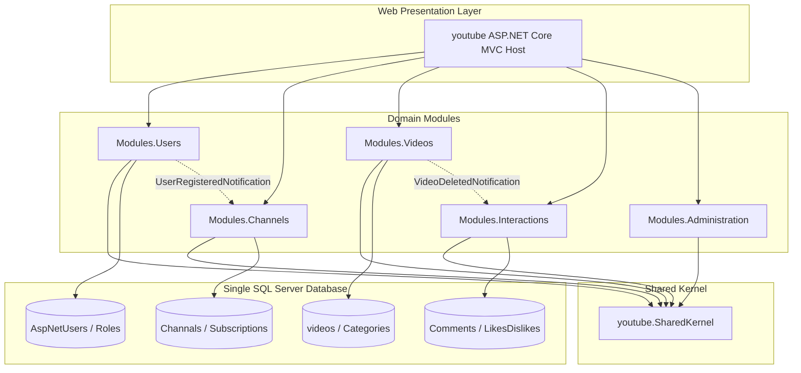

# VidPulse — Modern YouTube Clone (Modular Monolith)

[](https://dotnet.microsoft.com/)
[](#-architecture-overview)
[](https://learn.microsoft.com/ef/core/)
[](https://cloudinary.com/)

VidPulse is a full-featured video sharing and streaming web platform built with **ASP.NET Core (net10.0)**. Originally constructed as a classic 3-tier N-layer application, it has been re-architected into a **Modular Monolith** with strict module boundaries, decoupled inter-module messaging via **MediatR**, and isolated Entity Framework Core contexts sharing a single SQL Server database.

---

## 🏛️ Architecture Overview

The system follows a **Modular Monolith** architectural style. Instead of a monolithic `DbContext` and tightly coupled generic repository layers (`IUnirOFWork`), business logic is partitioned into dedicated domain modules.

### High-Level Architecture Diagram



### Architectural Principles Applied

1. **Bounded Contexts**: Each module encapsulates its domain entities, business logic, EF Core database configuration, queries, and commands.
2. **Decoupled Communication**:
   - **Cross-module events**: Modules publish domain notifications (`UserRegisteredNotification`, `VideoDeletedNotification`) over **MediatR**. Modules never reference another module's `DbContext`.
   - **Read contracts**: When read-only cross-module data is needed, public queries and immutable DTOs are exposed (e.g., `GetUserSummaryQuery`, `GetChannelSummaryQuery`).
3. **Dedicated DbContexts**: Each module manages its own `DbContext` (`UsersDbContext`, `ChannelsDbContext`, `VideosDbContext`, `InteractionsDbContext`) with isolated entity mappings while targeting the shared database schema.
4. **Retired Generic Abstractions**: Removed leaky generic repositories (`BaseRepo`) and generic `IUnitOfWork`. Handlers query EF Core directly with optimized projections (`AsNoTracking`, `Select`).

---

## 📦 Modules & Features

### 1. 👥 Users Module (`Modules/Users`)

- **Entities**: `AppUser`, `AppRole`.
- **Authentication**: ASP.NET Core Identity integration with cookie authentication.
- **Commands & Handlers**:
  - `RegisterCommand`: Registers user, hashes credentials, assigns default `Member` role, and dispatches `UserRegisteredNotification`.
  - `LoginCommand`: Validates credentials and signs in the user.
  - `LogoutCommand`: Signs out the user session.
- **Queries**: `GetUserSummaryQuery` for user profile lookups.

### 2. 📺 Channels Module (`Modules/Channels`)

- **Entities**: `Channel`, `Subscription`.
- **Channel Management**:
  - Custom channel name, bio/about description, and subscriber statistics.
  - Automatic channel bootstrap upon user registration via `UserRegisteredHandler`.
- **Subscriptions**:
  - `ToggleSubscribeCommand`: Handles subscribing and unsubscribing from channels.
  - Prevents users from subscribing to their own channels.
- **Queries**: `GetChannelByUserIdQuery`, `GetChannelByIdQuery`, `GetChannelSummaryQuery`.

### 3. 🎥 Videos Module (`Modules/Videos`)

- **Entities**: `Video`, `Category`.
- **Video Ingestion & Streaming**:
  - Direct video uploads processed via `CloudinaryService` (supports up to 100 MB uploads).
  - YouTube link integration: Paste YouTube links to automatically extract watch IDs and thumbnail URLs via `YouTubeHelper`.
- **Video Management**:
  - `SaveVideoCommand`: Create and edit videos with category tagging, custom title, and description.
  - `DeleteVideoCommand`: Removes video and dispatches `VideoDeletedNotification` to trigger cascade cleanup.
  - `IncrementVideoViewsCommand`: Increments and tracks view metrics.
- **Queries**: `GetHomeVideosQuery`, `GetVideoByIdQuery`, `GetVideosByCategoryQuery`.

### 4. 💬 Interactions Module (`Modules/Interactions`)

- **Entities**: `Comment`, `LikeDislike`.
- **Reactions**:
  - `ToggleLikeCommand`: Like or dislike videos with real-time tally tracking and anti-duplicate vote prevention.
- **Comments**:
  - `AddCommentCommand` & `DeleteCommentCommand`: Post and manage video comments.
- **Cascade Cleanup**:
  - `VideoDeletedHandler`: Automatically cleans up likes, dislikes, and comments when a video is deleted.

### 5. 🛡️ Administration Module (`Modules/Administration`)

- **User Moderation**: `GetAdminUsersQuery`, `DeleteAdminUserCommand`.
- **Category Management**:
  - Manage categories (`Music`, `Gaming`, `News`, `Sports`, `Movies`, etc.).
  - `CreateCategoryCommand`, `EditCategoryCommand`, `DeleteCategoryCommand`.

### 6. 🧩 Shared Kernel (`youtube.SharedKernel`)

- **Common Contracts**: `BaseEntity`, `Result`, `Result<T>`.
- **Domain Events**: `UserRegisteredNotification`, `VideoDeletedNotification`, `UserDeletedNotification`.
- **Constants & Helpers**: `SD` (Roles, Notifications), `YouTubeHelper` (YouTube parsing & thumbnail extraction).

---

## 💻 Web Presentation Layer (`youtube`)

- **ASP.NET Core MVC**: Modern Razor Views with customized Dark Mode styling and dynamic layouts.
- **Upload Configuration**: Configured Kestrel server limits and multipart form options to support 100MB video uploads.
- **Database Seeding**: [DatabaseInitializer.cs](file:///c:/Users/ahmed/source/repos/youtube/youtube/DatabaseInitializer.cs) seeds roles (`Admin`, `Member`), demo users, categories, channels, and featured videos automatically on first startup.

---

## 🚀 Getting Started

### Prerequisites

- [.NET 10.0 SDK](https://dotnet.microsoft.com/download/dotnet/10.0) (or preview runtime)
- [Microsoft SQL Server](https://www.microsoft.com/sql-server) or LocalDB
- [Cloudinary Account](https://cloudinary.com/) (for video and thumbnail storage)

### Installation & Setup

1. **Clone the repository**:

   ```bash
   git clone https://github.com/ahmed-Basal/YouTube-Clone.git
   cd YouTube-Clone
   ```

2. **Configure `appsettings.json`**:
   Ensure connection strings and Cloudinary credentials are set in `youtube/appsettings.json`:

   ```json
   {
     "ConnectionStrings": {
       "DefaultConnection": "Server=.;Database=vidpulsedb;Trusted_Connection=True;TrustServerCertificate=True;"
     },
     "Cloudinary": {
       "CloudName": "your_cloud_name",
       "ApiKey": "your_api_key",
       "ApiSecret": "your_api_secret"
     }
   }
   ```

3. **Build the Solution**:

   ```bash
   dotnet build youtube.slnx
   ```

4. **Run the Application**:

   ```bash
   dotnet run --project youtube/youtube.csproj
   ```

5. **Access the Web App**:
   Navigate to:

   ```text
   http://localhost:5242
   ```

---

## 📂 Project Structure

```plaintext
├── Modules/
│   ├── Administration/         # Admin queries, category & user moderation
│   ├── Channels/               # Channel management, subscriptions, event listeners
│   ├── Interactions/           # Comments, likes/dislikes reaction engine
│   ├── Users/                  # Identity authentication, AppUser, AppRole
│   └── Videos/                 # Video lifecycle, Cloudinary uploads, categories
├── youtube.SharedKernel/       # Domain events, common Result types, SD constants
├── youtube/                    # ASP.NET Core Web Host, Controllers, Razor Views
│   ├── Features/               # Feature-based controllers and vertical slices
│   ├── Views/                  # VidPulse Razor views and layouts
│   ├── DatabaseInitializer.cs  # Automated multi-context database seeder
│   └── Program.cs              # Web application entry point
├── youtube.slnx                # Solution file
└── README.md
```

---

## 🛠️ Technology Stack

| Category | Technology |
|---|---|
| **Platform** | .NET 10 (C#) |
| **Framework** | ASP.NET Core MVC |
| **Architecture** | Modular Monolith + Vertical Feature Slices |
| **Data Access** | Entity Framework Core 10 |
| **Database** | Microsoft SQL Server |
| **Messaging** | MediatR (CQRS & Domain Events) |
| **Cloud Storage** | CloudinaryDotNet |
| **Authentication** | ASP.NET Core Identity |

---

## 📝 License

This project is open-source and available under the [MIT License](LICENSE).